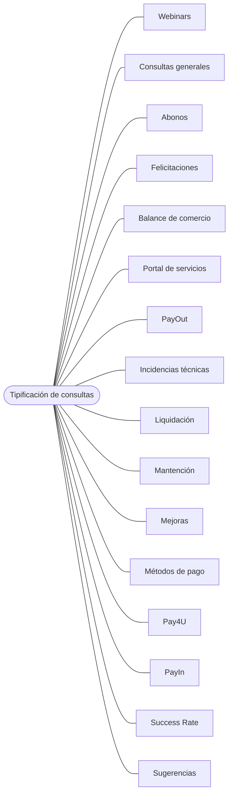

Si tienes dudas, consultas o sugerencias sobre los reportes transaccionales o financieros de tu comercio u otros temas, puedes contactar a nuestro equipo de Customer support, para ser atendido.

El servicio de atención a comercios está disponible las 24 horas del día, los 7 días de la semana, durante todo el año.

Algunos casos que pueden ser atendido por estos canales son:

 

