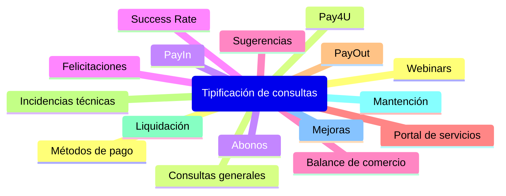

Si tienes dudas, consultas o sugerencias sobre los reportes transaccionales o financieros de tu comercio u otros temas, puedes contactar a nuestro equipo de Customer support, para ser atendido.

El servicio de atención a comercios está disponible las 24 horas del día, los 7 días de la semana, durante todo el año.

Algunos casos que pueden ser atendido por estos canales son:

 

<!-- Tipificación de consultas – SVG pastel/neutral -->

\<svg viewBox="-640 -360 1280 720" width="100%" xmlns="http\://www\.w3.org/2000/svg" role="img" aria-labelledby="title desc">
&#x20; \<title id="title">Tipificación de consultas\</title>
&#x20; \<desc id="desc">Diagrama radial con un nodo central y 16 categorías alrededor, colores pastel.\</desc>

&#x20; \<defs>
&#x20;   \

&#x20;   \<!-- Sombra muy sutil -->
&#x20;   \<filter id="s" x="-20%" y="-20%" width="140%" height="140%">
&#x20;     \<feDropShadow dx="0" dy="1" stdDeviation="2" flood-color="#000000" flood-opacity="0.06"/>
&#x20;   \</filter>
&#x20; \</defs>

&#x20; \<!-- Centro -->
&#x20; \<rect class="node p6 shadow" x="-190" y="-38" width="380" height="76" />
&#x20; \<text class="label center-label" x="0" y="0">Tipificación de consultas\</text>

&#x20; \<!-- Líneas izquierda -->
&#x20; \<!-- y targets: -220,-160,-100,-40,20,80,140,200 -->
&#x20; \<g class="edge">
&#x20;   \<line x1="-190" y1="-18" x2="-390" y2="-220"/>
&#x20;   \<line x1="-190" y1="-12" x2="-390" y2="-160"/>
&#x20;   \<line x1="-190" y1="-6"  x2="-390" y2="-100"/>
&#x20;   \<line x1="-190" y1="0"   x2="-390" y2="-40"/>
&#x20;   \<line x1="-190" y1="6"   x2="-390" y2="20"/>
&#x20;   \<line x1="-190" y1="12"  x2="-390" y2="80"/>
&#x20;   \<line x1="-190" y1="18"  x2="-390" y2="140"/>
&#x20;   \<line x1="-190" y1="24"  x2="-390" y2="200"/>
&#x20; \</g>

&#x20; \<!-- Líneas derecha -->
&#x20; \<g class="edge">
&#x20;   \<line x1="190" y1="-18" x2="390" y2="-220"/>
&#x20;   \<line x1="190" y1="-12" x2="390" y2="-160"/>
&#x20;   \<line x1="190" y1="-6"  x2="390" y2="-100"/>
&#x20;   \<line x1="190" y1="0"   x2="390" y2="-40"/>
&#x20;   \<line x1="190" y1="6"   x2="390" y2="20"/>
&#x20;   \<line x1="190" y1="12"  x2="390" y2="80"/>
&#x20;   \<line x1="190" y1="18"  x2="390" y2="140"/>
&#x20;   \<line x1="190" y1="24"  x2="390" y2="200"/>
&#x20; \</g>

&#x20; \<!-- Nodos izquierda -->
&#x20; \<g>
&#x20;   \<rect class="node p1 shadow" x="-500" y="-242" width="220" height="44"/>\<text class="label" x="-390" y="-220">Webinars\</text>
&#x20;   \<rect class="node p2 shadow" x="-500" y="-182" width="220" height="44"/>\<text class="label" x="-390" y="-160">Consultas generales\</text>
&#x20;   \<rect class="node p3 shadow" x="-500" y="-122" width="220" height="44"/>\<text class="label" x="-390" y="-100">Abonos\</text>
&#x20;   \<rect class="node p4 shadow" x="-500" y="-62"  width="220" height="44"/>\<text class="label" x="-390" y="-40">Felicitaciones\</text>
&#x20;   \<rect class="node p5 shadow" x="-500" y="-2"   width="220" height="44"/>\<text class="label" x="-390" y="20">Balance de comercio\</text>
&#x20;   \<rect class="node p8 shadow" x="-500" y="58"   width="220" height="44"/>\<text class="label" x="-390" y="80">Portal de servicios\</text>
&#x20;   \<rect class="node p7 shadow" x="-500" y="118"  width="220" height="44"/>\<text class="label" x="-390" y="140">PayOut\</text>
&#x20;   \<rect class="node p1 shadow" x="-500" y="178"  width="220" height="44"/>\<text class="label" x="-390" y="200">Incidencias técnicas\</text>
&#x20; \</g>

&#x20; \<!-- Nodos derecha -->
&#x20; \<g>
&#x20;   \<rect class="node p2 shadow" x="280" y="-242" width="220" height="44"/>\<text class="label" x="390" y="-220">Liquidación\</text>
&#x20;   \<rect class="node p3 shadow" x="280" y="-182" width="220" height="44"/>\<text class="label" x="390" y="-160">Mantención\</text>
&#x20;   \<rect class="node p4 shadow" x="280" y="-122" width="220" height="44"/>\<text class="label" x="390" y="-100">Mejoras\</text>
&#x20;   \<rect class="node p5 shadow" x="280" y="-62"  width="220" height="44"/>\<text class="label" x="390" y="-40">Métodos de pago\</text>
&#x20;   \<rect class="node p8 shadow" x="280" y="-2"   width="220" height="44"/>\<text class="label" x="390" y="20">Pay4U\</text>
&#x20;   \<rect class="node p7 shadow" x="280" y="58"   width="220" height="44"/>\<text class="label" x="390" y="80">PayIn\</text>
&#x20;   \<rect class="node p1 shadow" x="280" y="118"  width="220" height="44"/>\<text class="label" x="390" y="140">Success Rate\</text>
&#x20;   \<rect class="node p2 shadow" x="280" y="178"  width="220" height="44"/>\<text class="label" x="390" y="200">Sugerencias\</text>
&#x20; \</g>
\</svg>

 
