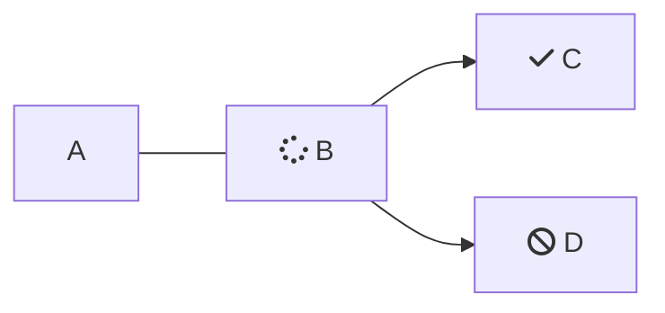

````markdown

```json
{
  "currency": "BRL",
  "country": "BR",
  "amount": 1000,
  "clientName": "John Doe"
  }
```

````
```json
{
  "currency": "BRL",
  "country": "BR",
  "amount": 1000,
  "clientName": "John Doe"
  }


```

<br />



<br />

<Cards columns={4}>
  <Card title="First Card" href="https://readme.com" icon="fa-home" target="_blank">
    Neque porro quisquam est qui dolorem ipsum quia
  </Card>

  <Card title="Second Card" icon="fa-user">
    *Lorem ipsum dolor sit amet, consectetur adipiscing elit*
  </Card>

  <Card title="Third Card" icon="fa-star">
    > Ut enim ad minim veniam, quis nostrud ullamco
  </Card>

  <Card title="Fourth Card" icon="fa-question">
    **Excepteur sint occaecat cupidatat non proident**
  </Card>
</Cards>

<Embed typeOfEmbed="github" url="" />

## Cómo hacer un pago

<br />

Consulta en [este enlace](www.la.com)

<br />

> ❗️ titulo
>
> bla bla bla

<br />

```json Ejemplo de body


{
  "currency": "BRL",
  "country": "BR",
  "amount": 1000,
  "clientName": "John Doe",
  "clientEmail": "johndoe@example.com",
  "clientPhone": "999999999",
  "clientDocument": "12345678912",
  "paymentMethod": "pix_payment",
  "urlConfirmation": "Webhook",
  "urlFinal": "example.com/successful",
  "urlRejected": "example.com/declined",
  "order": "1234",
  "sing": "Signature of the parameters",
  "typePixPayment": 1,
  "isIframePay": "true"
}
```
```
```

<br />

***

|    |    |    |
| :- | :- | :- |
| a  |    |    |
|    |    |    |

<br />

<HTMLBlock>{`
<!DOCTYPE html>
<html>
<body>

<p><a href="https://www.postman.com/prontopaga-api/workspace/prontopaga-docs/request/34607190-f4af4947-106e-4346-916a-e54c2d266f7a?action=share&creator=45976681&ctx=documentation" target="_blank">
  
</a></p>

</body>
</html>
`}</HTMLBlock>

<br />

<table>
  <tr>
    <th>Producto</th>
    <th>Imagen</th>
  </tr>

  <tr>
    <td>Zapatos</td>

    <td>
      
    </td>
  </tr>

  <tr>
    <td>Camiseta</td>

    <td>
      
    </td>
  </tr>
</table>

<Image align="center" src="https://files.readme.io/318f64c72032f868f3fa8cb7f77317be1c72910a3d70955e008e56a3865c4539-31.svg" />

<br />

<br />

<HTMLBlock>{`
<iframe style="border: 1px solid rgba(0, 0, 0, 0.1);" width="800" height="450" src="https://embed.figma.com/proto/sR8GayinfgLhXyMxlKjNJI/Demos-PayOuts-Prontopaga?page-id=11830%3A66971&node-id=11830-66973&viewport=1195%2C172%2C0.04&scaling=scale-down&content-scaling=fixed&starting-point-node-id=11830%3A66973&embed-host=share" allowfullscreen></iframe>
`}</HTMLBlock>

<Image align="center" src="https://files.readme.io/993783d3f97cd98ed52ccd0a1be04cc657b551f048139e85a23fbc3260267106-Coverage_in_Argentina.jpg" />

<br />

<br />

<br />

\<Tabs>
&#x20; \<Tab title="A">
&#x20;   \<table>
&#x20; \<thead>
&#x20;   \<tr style="background-color:#ff1f55; color:white; text-align:left;">
&#x20;     \<th>\<b>Tipo de tarjeta\</b>\</th>
&#x20;     \<th>\<b>Número de tarjeta\</b>\</th>
&#x20;     \<th>\<b>Fecha de vencimiento\</b>\</th>
&#x9;		\<th>\<b>CVV\</b>\</th>
&#x20;   \</tr>
&#x20; \</thead>
&#x20; \<tbody>
&#x20;   \<tr>\<td>Visa\</td>\<td>4147463011110059\</td>\<td>dic-29\</td>\<td>123\</td>\</tr>
&#x20;   \<tr>\<td>Mastercard\</td>\<td>5165850000000008\</td>\<td>dic-29\</td>\<td>123\</td>\</tr>
&#x20;   \<tr>\<td>Mastercard\</td>\<td>5200000000002490\</td>\<td>dic-28\</td>\<td>123\</td>\</tr>\</tr>
&#x20; \</tbody>
\</table>
&#x20; \</Tab>

&#x20; \<Tab title="B">
&#x20;   Here's content that's only inside the second Tab.
&#x20; \</Tab>

&#x20; \<Tab title="C">
&#x20;   Here's content that's only inside the third Tab.
&#x20; \</Tab>

&#x20; \<Tab title="D">
&#x20;   Welcome to the content that you can only see inside the first Tab.
&#x20; \</Tab>

&#x20; \<Tab title="E">
&#x20;   Here's content that's only inside the second Tab.
&#x20; \</Tab>

&#x20; \<Tab title="F">
&#x20;   Here's content that's only inside the third Tab.
&#x20; \</Tab>

&#x20; \<Tab title="G">
&#x20;   Welcome to the content that you can only see inside the first Tab.
&#x20; \</Tab>

&#x20; \<Tab title="H">
&#x20;   Here's content that's only inside the second Tab.
&#x20; \</Tab>

&#x20; \<Tab title="I">
&#x20;   Here's content that's only inside the third Tab.
&#x20; \</Tab>

&#x20; \<Tab title="J">
&#x20;   Welcome to the content that you can only see inside the first Tab.
&#x20; \</Tab>

&#x20; \<Tab title="K">
&#x20;   Here's content that's only inside the second Tab.
&#x20; \</Tab>

&#x20; \<Tab title="L">
&#x20;   Here's content that's only inside the third Tab.
&#x20; \</Tab>

&#x20; \<Tab title="M">
&#x20;   Welcome to the content that you can only see inside the first Tab.
&#x20; \</Tab>

&#x20; \<Tab title="N">
&#x20;   Here's content that's only inside the second Tab.
&#x20; \</Tab>

&#x20; \<Tab title="O">
&#x20;   Here's content that's only inside the third Tab.
&#x20; \</Tab>

&#x20; \<Tab title="P">
&#x20;   Welcome to the content that you can only see inside the first Tab.
&#x20; \</Tab>

&#x20; \<Tab title="Q">
&#x20;   Here's content that's only inside the second Tab.
&#x20; \</Tab>

&#x20; \<Tab title="R">
&#x20;   Here's content that's only inside the third Tab.
&#x20; \</Tab>

&#x20; \<Tab title="S">
&#x20;   Welcome to the content that you can only see inside the first Tab.
&#x20; \</Tab>

&#x20; \<Tab title="T">
&#x20;   Here's content that's only inside the second Tab.
&#x20; \</Tab>

&#x20; \<Tab title="U">
&#x20;   Here's content that's only inside the third Tab.
&#x20; \</Tab>

&#x20; \<Tab title="V">
&#x20;   Welcome to the content that you can only see inside the first Tab.
&#x20; \</Tab>

&#x20; \<Tab title="W">
&#x20;   Here's content that's only inside the second Tab.
&#x20; \</Tab>

&#x20; \<Tab title="X">
&#x20;   Here's content that's only inside the third Tab.
&#x20; \</Tab>

&#x20; \<Tab title="Y">
&#x20;   Welcome to the content that you can only see inside the first Tab.
&#x20; \</Tab>

&#x20; \<Tab title="Z">
&#x20;   Here's content that's only inside the second Tab.
&#x20; \</Tab>
\</Tabs>

\<Cards columns=\{2}>
&#x20; \<Card title="API" href="https\://readme.com" icon="fa-home" target="\_blank">
&#x20;   Conjunto de reglas que definen cómo dos aplicaciones de software se comunican entre sí para intercambiar datos y funcionalidades.
&#x20; \</Card>

&#x20; \<Card title="Second Card" icon="fa-user">
&#x20;   \*Lorem ipsum dolor sit amet, consectetur adipiscing elit\*
&#x20; \</Card>
\</Cards>

/
