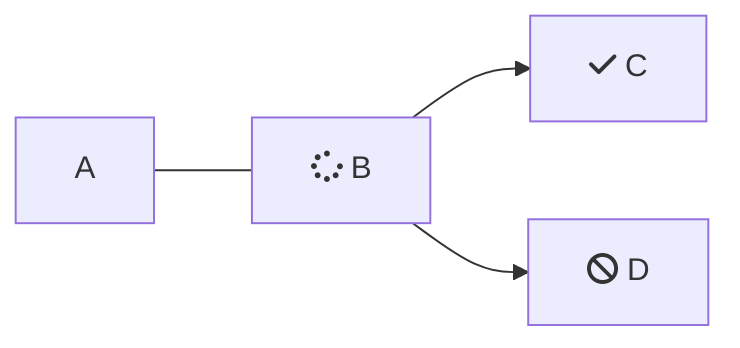

````markdown

```json
{
  "currency": "BRL",
  "country": "BR",
  "amount": 1000,
  "clientName": "John Doe"
  }
```

````
```json
{
  "currency": "BRL",
  "country": "BR",
  "amount": 1000,
  "clientName": "John Doe"
  }


```

<br />



<br />

<Cards columns={4}>
  <Card title="First Card" href="https://readme.com" icon="fa-home" target="_blank">
    Neque porro quisquam est qui dolorem ipsum quia
  </Card>

  <Card title="Second Card" icon="fa-user">
    *Lorem ipsum dolor sit amet, consectetur adipiscing elit*
  </Card>

  <Card title="Third Card" icon="fa-star">
    > Ut enim ad minim veniam, quis nostrud ullamco
  </Card>

  <Card title="Fourth Card" icon="fa-question">
    **Excepteur sint occaecat cupidatat non proident**
  </Card>
</Cards>

<Embed typeOfEmbed="github" url="" />

## Cómo hacer un pago

<br />

Consulta en [este enlace](www.la.com)

<br />

> ❗️ titulo
>
> bla bla bla

<br />

```json Ejemplo de body


{
  "currency": "BRL",
  "country": "BR",
  "amount": 1000,
  "clientName": "John Doe",
  "clientEmail": "johndoe@example.com",
  "clientPhone": "999999999",
  "clientDocument": "12345678912",
  "paymentMethod": "pix_payment",
  "urlConfirmation": "Webhook",
  "urlFinal": "example.com/successful",
  "urlRejected": "example.com/declined",
  "order": "1234",
  "sing": "Signature of the parameters",
  "typePixPayment": 1,
  "isIframePay": "true"
}
```
```
```

<br />

***

|    |    |    |
| :- | :- | :- |
| a  |    |    |
|    |    |    |

<br />

<HTMLBlock>{`
<!DOCTYPE html>
<html>
<body>

<p><a href="https://www.postman.com/prontopaga-api/workspace/prontopaga-docs/request/34607190-f4af4947-106e-4346-916a-e54c2d266f7a?action=share&creator=45976681&ctx=documentation" target="_blank">
  
</a></p>

</body>
</html>
`}</HTMLBlock>

<br />

<table>
  <tr>
    <th>Producto</th>
    <th>Imagen</th>
  </tr>

  <tr>
    <td>Zapatos</td>

    <td>
      
    </td>
  </tr>

  <tr>
    <td>Camiseta</td>

    <td>
      
    </td>
  </tr>
</table>

<Image align="center" border={false} src="https://files.readme.io/318f64c72032f868f3fa8cb7f77317be1c72910a3d70955e008e56a3865c4539-31.svg" />

<br />

<br />

<HTMLBlock>{`
<iframe style="border: 1px solid rgba(0, 0, 0, 0.1);" width="800" height="450" src="https://embed.figma.com/proto/sR8GayinfgLhXyMxlKjNJI/Demos-PayOuts-Prontopaga?page-id=11830%3A66971&node-id=11830-66973&viewport=1195%2C172%2C0.04&scaling=scale-down&content-scaling=fixed&starting-point-node-id=11830%3A66973&embed-host=share" allowfullscreen></iframe>
`}</HTMLBlock>

<Image align="center" border={false} src="https://files.readme.io/993783d3f97cd98ed52ccd0a1be04cc657b551f048139e85a23fbc3260267106-Coverage_in_Argentina.jpg" />

<br />

<HTMLBlock>{`
<Tabs>
  <Tab title="A">
       * **API:** Conjunto de reglas, protocolos y endpoints que permiten que tu sistema de software se comunique con otro.
	</Tab>
</Tabs>
`}</HTMLBlock>

Tabs>
\<Tab title="First Tab">
Welcome to the content that you can only see inside the first Tab.
\</Tab>

\<Tab title="Second Tab">
Here's content that's only inside the second Tab.
\</Tab>

\<Tab title="Third Tab">
Here's content that's only inside the third Tab.
\</Tab>
\</Tabs>

\<Tabs>
\<Tab title="First Tab">
Welcome to the content that you can only see inside the first Tab.
\</Tab>

\<Tab title="Second Tab">
Here's content that's only inside the second Tab.
\</Tab>

\<Tab title="Third Tab">
Here's content that's only inside the third Tab.
\</Tab>
\</Tabs>

\<Tabs>
\<Tab title="First Tab">
Welcome to the content that you can only see inside the first Tab.
\</Tab>

\<Tab title="Second Tab">
Here's content that's only inside the second Tab.
\</Tab>

\<Tab title="Third Tab">
Here's content that's only inside the third Tab.
\</Tab>
\</Tabs>

<br />

<br />

Payphone Wallet -> Ecuador

Se le puede pasar un bgColor (valor hexadecimal con su '#' al principio), mode (light o dark), type (default o simple)

* Crear nuevo endopoint: Ecuador Wallet (with customized form)
* Subir a postman
* Crear ejemplo 200 y 400

```
{
  "currency": "USD",
  "country": "EC",
  "amount": "25.90",
  "clientName": "John Doe",
  "clientEmail": "johndoe@example.com",
  "clientPhone": "0912345678",
  "clientDocument": "12345678912",
  "paymentMethod": "payphone_payment",
  "urlConfirmation": "https://www.webhook.com",
  "urlFinal": "https://sandbox.prontopaga.com/successful",
  "urlRejected": "https://sandbox.prontopaga.com/declined",
  "theme": "[{\"bgColor\": \"transparent\", \"mode\": \"dark\”, \"type\": \"simple\”}]”
	"order": "XYZ789",
	"sign": "Signature of the parameters"
}


 "theme": "[{\"bgColor\": \"transparent\", \"mode\": \"dark\"}]",
 "sign": "Signature of the parameters"
```

***

<br />

GmoneyQR, LigoQR y NiubizQR -> Perú

Ya estaba arriba con antelación

```
{
  "currency": "PEN",
  "country": "PE",
  "amount": "100.90",
  "clientName": "John Doe",
  "clientEmail": "johndoe@example.com",
  "clientPhone": "999999999",
  "clientDocument": "12345678912",
  "paymentMethod": "pe_qr_payment",
  "urlConfirmation": "https://www.webhook.com",
  "urlFinal": "https://sandbox.prontopaga.com/successful",
  "urlRejected": "https://sandbox.prontopaga.com/declined",
  "order": "XYZ789",
  "theme": "[{\"bgColor\": \"transparent\", \"mode\": \"dark\"}]",
  "sign": "Signature of the parameters"
}
```

***

<br />

Niubiz Tarjeta -> Perú

Ya estaba con antelación

```
{
  "currency": "PEN",
  "country": "PE",
  "amount": "100.90",
  "clientName": "John Doe",
  "clientEmail": "johndoe@example.com",
  "clientPhone": "999999999",
  "clientDocument": "12345678912",
  "paymentMethod": "pe_card_payment",
  "urlConfirmation": "https://www.webhook.com",
  "urlFinal": "https://sandbox.prontopaga.com/successful",
  "urlRejected": "https://sandbox.prontopaga.com/declined",
  "order": "XYZ789",
  "theme": "[{\"bgColor\": \"transparent\", \"mode\": \"dark\"}]",
  "sign": "Signature of the parameters"
}
```

***

PixQR BancoRendimiento -> Brasil

* Crear nuevo endpoint: Brazil PIX (with customized form)
* Subir a postman
* Crear ejemplo 200 y 400

```
{
  "currency": "BRL",
  "country": "BR",
  "amount": "150.90",
  "clientName": "John Doe",
  "clientEmail": "johndoe@example.com",
  "clientPhone": "999999999",
  "clientDocument": "12345678912",
  "paymentMethod": "pix_payment",
  "urlConfirmation": "https://www.webhook.com",
  "urlFinal": "https://sandbox.prontopaga.com/successful",
  "urlRejected": "https://sandbox.prontopaga.com/declined",
  "order": "XYZ789",
  "typePixPayment": 1,
  "sign": "Signature of the parameters"
}
```

<br />

<br />

## Plugins oficiales de ProntoPaga

Estos plugins están listos para ser integrados hoy mismo en tu comercio:

| <center><h2>Plataformas compatibles</h2></center>                                                                                                                                                                                                                                                                                                                                                                  |
| :----------------------------------------------------------------------------------------------------------------------------------------------------------------------------------------------------------------------------------------------------------------------------------------------------------------------------------------------------------------------------------------------------------------- |
| <center>        <Button variant="primary" text="Ver guía" icon="fa-solid fa-arrow-up-right-from-square" href="https://docs.prontopaga.com/docs/prestashop#/" target="_blank" /></center>               |
| <center>                   <Button variant="primary" text="Ver guía" icon="fa-solid fa-arrow-up-right-from-square" href="https://docs.prontopaga.com/docs/vtex#/" target="_blank" /></center>                            |
| <center>        <Button variant="primary" text="Ver guía" icon="fa-solid fa-arrow-up-right-from-square" href="https://docs.prontopaga.com/docs/woocommerce#/" target="_blank" /></center>                |
| <center>        <Button variant="primary" text="Ver guía" icon="fa-solid fa-arrow-up-right-from-square" href="https://docs.prontopaga.com/docs/magento#/" target="_blank" /></center> |

<GuideCard
  title="🚀 Cómo empezar tu integración"
  description={
    <ol>
      <li><h3>Selecciona tu plataforma</h3></li>
      <li><h3>Descarga e instala el plugin</h3></li>
      <li><h3>Prueba tu integración</h3></li>
      <li><h3>¡Listo!</h3></li>
   </ol>
  }
/>

<br />

<br />

## 🔌 Plugins oficiales de ProntoPaga

Estos plugins están listos para ser integrados hoy mismo en tu comercio:

<Cards columns={2}>
  <center>
    <Card>
      <div
        style={{
      display: 'flex',
      flexDirection: 'column',
      alignItems: 'center',
      justifyContent: 'center',
      height: '250px'
    }}
      >
        

        <h3>PrestaShop</h3>
        Optimiza el proceso de cobre en tiendas PrestaShop con el plugin de ProntoPaga.

        <Button variant="primary" text="Ver guía" icon="fa-solid fa-arrow-up-right-from-square" href="https://docs.prontopaga.com/docs/prestashop#/" target="_blank" />

        <br />
      </div>
    </Card>
  </center>

  <center>
    <Card>
      <div
        style={{
      display: 'flex',
      flexDirection: 'column',
      alignItems: 'center',
      justifyContent: 'center',
      height: '250px'
    }}
      >
        

        <h3>VTEX</h3>
        Mejora conversiones con transacciones seguras y rápidas con el plugin de ProntoPaga.

        <Button variant="primary" text="Ver guía" icon="fa-solid fa-arrow-up-right-from-square" href="https://docs.prontopaga.com/docs/vtex#/" target="_blank" />

        <br />
      </div>
    </Card>
  </center>

  <center>
    <Card>
      <div
        style={{
      display: 'flex',
      flexDirection: 'column',
      alignItems: 'center',
      justifyContent: 'center',
      height: '250px'
    }}
      >
        

        <h3>WooCommerce</h3>
        Con el plugin de ProntoPaga de Wordpress + WooCommerce acepta pagos de forma segura y rápida.

        <Button variant="primary" text="Ver guía" icon="fa-solid fa-arrow-up-right-from-square" href="https://docs.prontopaga.com/docs/woocommerce#/" target="_blank" />

        <br />
      </div>
    </Card>
  </center>

  <center>
    <Card>
      <div
        style={{
      display: 'flex',
      flexDirection: 'column',
      alignItems: 'center',
      justifyContent: 'center',
      height: '250px'
    }}
      >
        

        <h3>Adobe Commerce (Magento)</h3>
        Acepta pagos de forma segura y eficiente con el plugin de ProntoPaga con Adobe Commerce (antes Magento).

        <Button variant="primary" text="Ver guía" icon="fa-solid fa-arrow-up-right-from-square" href="https://docs.prontopaga.com/docs/magento#/" target="_blank" />

        <br />
      </div>
    </Card>
  </center>
</Cards>

## 🚀 Cómo empezar tu integración

<Cards columns={4} className="pp-cards--equal">
  <Card>
    <div
      style={{
      display: 'flex',
      flexDirection: 'column',
      alignItems: 'center',
      justifyContent: 'center',
      height: '200px'
    }}
    >
      <i className="fa-solid fa-hand-pointer" style={{ fontSize: '24px', marginBottom: '8px' }} />

      <strong><center>Selecciona tu plataforma</center></strong>
    </div>
  </Card>

  <Card>
    <div
      style={{
      display: 'flex',
      flexDirection: 'column',
      alignItems: 'center',
      justifyContent: 'center',
      height: '140px'
    }}
    >
      <i className="fa-solid fa-plug" style={{ fontSize: '24px', marginBottom: '8px' }} />

      <strong><center>Descarga e instala el plugin</center></strong>
    </div>
  </Card>

  <Card>
    <div
      style={{
      display: 'flex',
      flexDirection: 'column',
      alignItems: 'center',
      justifyContent: 'center',
      height: '140px'
    }}
    >
      <i className="fa-solid fa-vial" style={{ fontSize: '24px', marginBottom: '8px' }} />

      <strong><center>Prueba tu integración</center></strong>
    </div>
  </Card>

  <Card>
    <div
      style={{
      display: 'flex',
      flexDirection: 'column',
      alignItems: 'center',
      justifyContent: 'center',
      height: '140px'
    }}
    >
      <i className="fa-solid fa-circle-check" style={{ fontSize: '24px', marginBottom: '8px' }} />

      <strong><center>¡Listo!</center></strong>
    </div>
  </Card>
</Cards>

<br />

<br />

<br />

<HTMLBlock>{`
<table>
  <thead>
    <tr style="background-color:#ff1f55; color:white; text-align:left;">
      <th><b>Marca</b></th>
			<th><b>Argentina</b></th>
      <th><b>Chile</b></th>
      <th><b>Ecuador</b></th>
			<th><b>Perú</b></th>
    </tr>
  </thead>
  <tbody>
    <tr><td>Visa</td><td>✔️</td><td>✔️</td><td>✔️</td><td>✔️</td></tr></tr>
    <tr><td>Mastercard</td><td>✔️</td><td>✔️</td><td>✔️</td><td>✔️</td></tr></tr>
		<tr><td>American Express</td><td>✔️</td><td>✔️</td><td>✖️</td><td>✔️</td></tr></tr>
		<tr><td>Diners Club International</td><td>✖️</td><td>✖️</td><td>✖️</td><td>✔️</td></tr></tr>
    <tr><td>UnionPay</td><td>✖️</td><td>✖️</td><td>✖️</td><td>✔️</td></tr></tr>
  </tbody>
</table>
`}</HTMLBlock>

<br />

<br />

<Cards columns={3}>
  <center>
    <Card>
      <div>
        

        <Button variant="primary" text="Ver datos de prueba" icon="fa-solid fa-arrow-up-right-from-square" href="https://docs.prontopaga.com/docs/test-data-webpay-cards" target="_blank" />

        <br />
      </div>
    </Card>
  </center>

  <center>
    <Card>
      <div>
        

        <Button variant="primary" text="Ver datos de prueba" icon="fa-solid fa-arrow-up-right-from-square" href="https://docs.prontopaga.com/docs/test-data-ecuador" target="_blank" />

        <br />
      </div>
    </Card>
  </center>

  <center>
    <Card>
      <div>
        

        <Button variant="primary" text="Ver datos de prueba" icon="fa-solid fa-arrow-up-right-from-square" href="https://docs.prontopaga.com/docs/test-data-cards-peru" target="_blank" />

        <br />
      </div>
    </Card>
  </center>
</Cards>

<br />

<Cards columns={3}>
  <center>
    <Card>
      <div>
        

        Consulta los datos de prueba para PayIns en Chile

        <Button variant="primary" text="Ver datos" icon="fa-solid fa-arrow-up-right-from-square" href="https://docs.prontopaga.com/docs/test-data-webpay-cards" target="_blank" />

        <br />
      </div>
    </Card>
  </center>

  <center>
    <Card>
      <div>
        

        Consulta los datos de prueba para PayIns en Ecuador

        <Button variant="primary" text="Ver datos" icon="fa-solid fa-arrow-up-right-from-square" href="https://docs.prontopaga.com/docs/test-data-ecuador" target="_blank" />

        <br />
      </div>
    </Card>
  </center>

  <center>
    <Card>
      <div>
        

        Consulta los datos de prueba para PayIns en Perú

        <Button variant="primary" text="Ver datos" icon="fa-solid fa-arrow-up-right-from-square" href="https://docs.prontopaga.com/docs/test-data-cards-peru" target="_blank" />

        <br />
      </div>
    </Card>
  </center>
</Cards>

<br />

<Button variant="primary" text="click" icon="fa-solid fa-users" />

<br />

<Cards columns={3}>
  <center>
    <Card>
      <div
        style={{
      display: 'flex',
      flexDirection: 'column',
      alignItems: 'center',
      justifyContent: 'center',
      height: '250px'
    }}
      >
        

        Consulta los datos de prueba para PayIns en Chile

        <Button variant="primary" text="Ver datos" icon="fa-solid fa-arrow-up-right-from-square" href="https://docs.prontopaga.com/docs/test-data-webpay-cards" target="_blank" />

        <br />
      </div>
    </Card>
  </center>

  <center>
    <Card>
      <div
        style={{
      display: 'flex',
      flexDirection: 'column',
      alignItems: 'center',
      justifyContent: 'center',
      height: '250px'
    }}
      >
        

        Consulta los datos de prueba para PayIns en Ecuador

        <Button variant="primary" text="Ver datos" icon="fa-solid fa-arrow-up-right-from-square" href="https://docs.prontopaga.com/docs/test-data-ecuador" target="_blank" />

        <br />
      </div>
    </Card>
  </center>

  <center>
    <Card>
      <div
        style={{
      display: 'flex',
      flexDirection: 'column',
      alignItems: 'center',
      justifyContent: 'center',
      height: '250px'
    }}
      >
        

        Consulta los datos de prueba para PayIns en Perú

        <Button variant="primary" text="Ver datos" icon="fa-solid fa-arrow-up-right-from-square" href="https://docs.prontopaga.com/docs/test-data-cards-peru" target="_blank" />

        <br />
      </div>
    </Card>
  </center>
</Cards>

<br />

<br />

<Cards columns={3}>
  <center>
    <Card>
      <div
        style={{
      display: 'flex',
      flexDirection: 'column',
      alignItems: 'center',
      justifyContent: 'center',
      height: '250px'
    }}
      >
        

        <Button variant="primary" text="Ver datos de prueba" icon="fa-solid fa-arrow-up-right-from-square" href="https://docs.prontopaga.com/docs/test-data-webpay-cards" target="_blank" />

        <br />
      </div>
    </Card>
  </center>

  <center>
    <Card>
      <div
        style={{
      display: 'flex',
      flexDirection: 'column',
      alignItems: 'center',
      justifyContent: 'center',
      height: '250px'
    }}
      >
        

        <Button variant="primary" text="Ver datos de prueba" icon="fa-solid fa-arrow-up-right-from-square" href="https://docs.prontopaga.com/docs/test-data-ecuador" target="_blank" />

        <br />
      </div>
    </Card>
  </center>

  <center>
    <Card>
      <div
        style={{
      display: 'flex',
      flexDirection: 'column',
      alignItems: 'center',
      justifyContent: 'center',
      height: '250px'
    }}
      >
        

        <Button variant="primary" text="Ver datos de prueba" icon="fa-solid fa-arrow-up-right-from-square" href="https://docs.prontopaga.com/docs/test-data-cards-peru" target="_blank" />

        <br />
      </div>
    </Card>
  </center>
</Cards>

<br />

<br />

```json
[
   {
      "code": 10,
      "name": "B. DEL PICHINCHA"
   },
   {
      "code": 17,
      "name": "B. DE GUAYAQUIL"
   },
   {
      "code": 21,
      "name": "COOP. A. Y C. RHUMY WARA"
   },
   {
      "code": 24,
      "name": "CITIBANK N.A. SUCURSAL ECUADOR"
   },
   {
      "code": 25,
      "name": "B. DE MACHALA"
   },
   {
      "code": 20,
      "name": "LLOYDS BANK"
   },
   {
      "code": 24,
      "name": "CITIBANK"
   },
   {
      "code": 25,
      "name": "BANCO MACHALA"
   },
   {
      "code": 27,
      "name": "B. DELBANK S.A ( BANINCO - BANCO INDUSTRIAL Y COMERCIAL S.A. )"
   },
   {
      "code": 29,
      "name": "B. DE LOJA"
   },
   {
      "code": 30,
      "name": "B. DEL PACIFICO"
   },
   {
      "code": 32,
      "name": "B. INTERNACIONAL"
   },
   {
      "code": 34,
      "name": "B. AMAZONAS"
   },
   {
      "code": 35,
      "name": "B. DEL AUSTRO"
   },
   {
      "code": 36,
      "name": "B. PRODUBANCO"
   },
   {
      "code": 37,
      "name": "B. BOLIVARIANO"
   },
   {
      "code": 39,
      "name": "B. COMERCIAL DE MANABI"
   },
   {
      "code": 42,
      "name": "B. GENERAL RUMIÑAHUI"
   },
   {
      "code": 43,
      "name": "B. DEL LITORAL"
   },
   {
      "code": 59,
      "name": "B. SOLIDARIO"
   },
   {
      "code": 60,
      "name": "B. PROCREDIT S.A."
   },
   {
      "code": 61,
      "name": "B. CAPITAL"
   },
   {
      "code": 81,
      "name": "COOP. A.Y C. GALAPAGOS LTDA."
   },
   {
      "code": 203,
      "name": "CACPECO"
   },
   {
      "code": 204,
      "name": "COOP. AHORRO Y CREDITO DE LA PEQUEÑA EMPRESA DE PASTAZA"
   },
   {
      "code": 205,
      "name": "COOP DE A Y C. 23 DE JULIO LTDA."
   },
   {
      "code": 206,
      "name": "COOPERATIVA 29 DE OCTUBRE"
   },
   {
      "code": 207,
      "name": "ANDALUCÍA LTDA."
   },
   {
      "code": 208,
      "name": "COTOCOLLAO LTDA."
   },
   {
      "code": 208,
      "name": "COOP. DE AHORRO Y CREDITO COTOCOLLAO LTDA."
   },
   {
      "code": 209,
      "name": "BANCO DESARROLLO DE LOS PUEBLOS S.A. CODESARROLLO"
   },
   {
      "code": 210,
      "name": "EL SAGRARIO LTDA."
   },
   {
      "code": 211,
      "name": "GUARANDA LTDA."
   },
   {
      "code": 213,
      "name": "JUVENTUD ECUATORIANA PROGRESISTA LTDA"
   },
   {
      "code": 215,
      "name": "B. COOPNACIONAL S.A."
   },
   {
      "code": 216,
      "name": "OSCUS LTDA."
   },
   {
      "code": 217,
      "name": "PABLO MUÑOZ VEGA"
   },
   {
      "code": 218,
      "name": "COOP. A. Y C. COOPROGRESO LTDA."
   },
   {
      "code": 219,
      "name": "RIOBAMBA LTDA."
   },
   {
      "code": 222,
      "name": "TULCÁN LTDA."
   },
   {
      "code": 223,
      "name": "ATUNTAQUI LTDA."
   },
   {
      "code": 224,
      "name": "COMERCIO LTDA."
   },
   {
      "code": 225,
      "name": "LA DOLOROSA LTDA."
   },
   {
      "code": 226,
      "name": "COOPERATIVA  PREVISION AHORRO Y DESARROLLO (COOPAD)"
   },
   {
      "code": 227,
      "name": "COOPERATIVA DE AHORRO Y CREDITO ALIANZA DEL VALLE LTDA."
   },
   {
      "code": 229,
      "name": "CHONE LTDA."
   },
   {
      "code": 231,
      "name": "SANTA ANA LTDA."
   },
   {
      "code": 232,
      "name": "B. DINERS CLUB"
   },
   {
      "code": 232,
      "name": "COOP. DE A. Y C. MERCEDES CADENA"
   },
   {
      "code": 233,
      "name": "M. AMBATO"
   },
   {
      "code": 234,
      "name": "M. AZUAY"
   },
   {
      "code": 236,
      "name": "M. IMBABURA"
   },
   {
      "code": 238,
      "name": "M. PICHINCHA"
   },
   {
      "code": 1008,
      "name": "SAN CRISTOBAL"
   },
   {
      "code": 1012,
      "name": "COOP. DE A. Y C. FINANCREDIT LTDA"
   },
   {
      "code": 1119,
      "name": "COOP. DE AHORRO Y CREDITO ONCE DE JUNIO"
   },
   {
      "code": 1137,
      "name": "COOP. A. Y C. NEGOCIOS ANDINOS LTDA"
   },
   {
      "code": 1141,
      "name": "COOP. SANTA ROSA LTDA."
   },
   {
      "code": 1142,
      "name": "COOP. DE A. Y C.  ANGAHUANA"
   },
   {
      "code": 1147,
      "name": "COOP. DE A. Y C. USUARIOS DEL AGUA MARIA INMACULADA LTDA"
   },
   {
      "code": 1182,
      "name": "SAN FRANCISCO DE ASIS"
   },
   {
      "code": 2129,
      "name": "MANUEL ESTEBAN GODOY ORTEGA LTDA. COOPMEGO."
   },
   {
      "code": 2753,
      "name": "9 DE OCTUBRE LTDA"
   },
   {
      "code": 3304,
      "name": "PADRE JULIAN LORENTE LTDA."
   },
   {
      "code": 3352,
      "name": "CACPE BIBLIAN LTDA"
   },
   {
      "code": 3364,
      "name": "COOP. AHORRO Y CREDITO SAN JOSE LTDA."
   },
   {
      "code": 3615,
      "name": "COOP. AHORRO Y CREDITO JARDIN AZUAYO"
   },
   {
      "code": 4003,
      "name": "BANCO-D-MIRO S.A."
   },
	 {
      "code": 4004,
      "name": "COOP.  A Y C DE LA PEQ. EMP. CACPE ZAMORA LTDA. (MIES)"
   },
   {
      "code": 4007,
      "name": "COOP. AHORRO Y CREDITO MUSHUK KAWSAY LTDA"
   },
   {
      "code": 4008,
      "name": "COOP. AHORRO Y CREDITO ALIANZA MINAS LTDA. (MIES)"
   },
   {
      "code": 4009,
      "name": "COOP. AHORRO Y CREDITO CAMARA DE COMERCIO DEL CANTON BOLIVAR LTDA.(MIES)"
   },
   {
      "code": 4010,
      "name": "COOP. AHORRO Y CREDITO CAMARA DE COMERCIO INDIGENA DE GUAMOTE LTDA(MIES)"
   },
   {
      "code": 4011,
      "name": "COOP. AHORRO Y CREDITO CARIAMANGA LTDA(MIES)"
   },
   {
      "code": 4012,
      "name": "COOP. DE AHORRO Y CREDITO DE LA CAMARA DE COMERCIO DE PINDAL (MIES)"
   },
   {
      "code": 4013,
      "name": "COOP. AHORRO Y CREDITO DE LA PEQUEÑA EMPRESA GUALAQUIZA (MIES)"
   },
   {
      "code": 4015,
      "name": "COOP. AHORRO Y CREDITO FUNDESARROLLO (MIES)"
   },
   {
      "code": 4019,
      "name": "COOP. AHORRO Y CREDITO MANANTIAL DE ORO LTDA. (MIES)"
   },
   {
      "code": 4020,
      "name": "COOP. AHORRO Y CREDITO MI TIERRA (MIES)"
   },
   {
      "code": 4021,
      "name": "COOP. AHORRO Y CREDITO NUEVA JERUSALEN (MIES)"
   },
	 {
      "code": 4022,
      "name": "COOP. DE AHORRO Y CREDITO PUELLARO LTDA. (MIES)"
   },
   {
      "code": 4023,
      "name": "COOP. DE A. Y C. SAN ANTONIO LIMITADA"
   },
   {
      "code": 4024,
      "name": "COOP. AHORRO Y CREDITO SAN GABRIEL LTDA.(MIES)"
   },
   {
      "code": 4025,
      "name": "COOP. AHORRO Y CREDITO SAN MIGUEL DE LOS BANCOS  (MIES)"
   },
   {
      "code": 4027,
      "name": "COOP. AHORRO Y CREDITO SEÑOR DE GIRÓN (MIES)"
   },
   {
      "code": 4028,
      "name": "COOP. AHORRO Y CREDITO TENA LTDA.(MIES)"
   },
   {
      "code": 4030,
      "name": "COOP. AHORRO Y CREDITO MUJERES UNIDAS TANTANAKUSHKA WARMIKUNAPAK CACMU LTDA.(MIES)"
   },
   {
      "code": 4031,
      "name": "COOP. DE A Y C EDUCADORES DE PASTAZA LTDA.(MIES)"
   },
   {
      "code": 4032,
      "name": "COOP. DE A Y C GONZANAMÁ (MIES)"
   },
   {
      "code": 4033,
      "name": "COOP. DE A Y C JUAN PIO DE MORA LTDA. (MIES)"
   },
   {
      "code": 4036,
      "name": "COOP. DE A. Y C. CASAG LTDA (MIES)"
   },
   {
      "code": 4037,
      "name": "COOP. DE A. Y C. CREDISUR LTDA. (MIES)"
   },
	 {
      "code": 4039,
      "name": "COOP. DE A. Y C. DE LOS SERV. PUBL. DEL MIN. DE EDUCACION Y CULTURA (MIES)"
   },
   {
      "code": 4044,
      "name": "COOP. DE A. Y C. FOCLA (MIESS)"
   },
   {
      "code": 4045,
      "name": "COOP. DE A. Y C. FUTURO Y PROGRESO DE GALAPAGOS LTDA. (MIES)"
   },
   {
      "code": 4048,
      "name": "COOP. DE A. Y C. GUAMOTE LTDA. (MIES)"
   },
   {
      "code": 4049,
      "name": "COOP. DE A. Y C. LUCHA CAMPESINA LTDA. (MIES)"
   },
   {
      "code": 4050,
      "name": "COOP. DE A. Y C. MAQUITA CUSHUN LTDA (MIES)"
   },
   {
      "code": 4051,
      "name": "COOP. DE A. Y C. MAQUITA CUSHUNCHIC LTDA. (MIES)"
   },
   {
      "code": 4052,
      "name": "COOP. DE A. Y C. PIJAL (MIES)"
   },
   {
      "code": 4054,
      "name": "COOP. DE A. Y C. SANTA ROSA DE PATUTAN LTDA. (MIES)"
   },
   {
      "code": 4055,
      "name": "COOP. DE A. Y C. SIERRA CENTRO LTDA. (MIES)"
   },
   {
      "code": 4056,
      "name": "COOP. DE A. Y C. SINCHI RUNA LTDA. (MIES)"
   },
   {
      "code": 4057,
      "name": "COOP. DE A. Y C. SUMAC LLACTA LTDA. (MIES)"
   },
	 {
      "code": 4059,
      "name": "COOP. DE A. Y C. VALLES DEL LIRIO (MIES)"
   },
   {
      "code": 4060,
      "name": "COOP. DE A. Y C. VENCEDORES DE TUNGURAHUA (MIES)"
   },
   {
      "code": 4061,
      "name": "COOP. DE AHORRO Y CRÉDITO SIMIATUG LTDA (MIES)"
   },
   {
      "code": 4062,
      "name": "COOP. AHORRO Y CREDITO 4 DE OCTUBRE LTDA.(MIES)"
   },
   {
      "code": 4064,
      "name": "COOP. AHORRO Y CREDITO  ALFONSO JARAMILLO C.C.C. (MIES)"
   },
   {
      "code": 4065,
      "name": "COOP. AHORRO Y CREDITO ANDINA LTDA.(MIES)"
   },
   {
      "code": 4067,
      "name": "COOP. DE AHORRO Y CREDITO CREDI FACIL LTDA.(MIES)"
   },
   {
      "code": 4068,
      "name": "COOP. DE AHORRO Y CREDITO CREDIAMIGO LTDA (MIES)"
   },
   {
      "code": 4069,
      "name": "COOP. AHORRO Y CREDITO CRISTO REY (MIES)"
   },
   {
      "code": 4070,
      "name": "COOP. AHORRO Y CREDITO DE LA PEQ. EMPRESA CACPE YANZATZA LTDA.(MIES)"
   },
   {
      "code": 4071,
      "name": "COOP. AHORRO Y CREDITO DORADO LTDA.(MIES)"
   },
   {
      "code": 4072,
      "name": "COOP. AHORRO Y CREDITO EDUCADORES DEL TUNGURAHUA LTDA. (MIES)"
   },
	 {
      "code": 4073,
      "name": "COOP. AHORRO Y CREDITO EDUCADORES DE CHIMBORAZO LTDA.(MIES)"
   },
   {
      "code": 4074,
      "name": "COOP. DE AHORRO Y CRÉDITO HUAICANA LTDA. (MIES)"
   },
   {
      "code": 4075,
      "name": "COOP. DE AHORRO Y  CREDITO HUAQUILLAS LTDA. (MIES)"
   },
   {
      "code": 4076,
      "name": "COOP. DE AHORRO Y CREDITO JADAN LTDA. (MIES)"
   },
   {
      "code": 4077,
      "name": "COOP. AHORRO Y CREDITO LA MERCED LTDA.CUE (MIES)"
   },
   {
      "code": 4078,
      "name": "COOP. AHORRO Y CREDITO MUSHUC RUNA LTDA."
   },
   {
      "code": 4079,
      "name": "COOP. AHORRO Y CREDITO NUESTOS ABUELOS LTDA (MIES)"
   },
   {
      "code": 4080,
      "name": "COOP. AHORRO Y CREDITO NUEVA HUANCAVILCA LTDA."
   },
   {
      "code": 4081,
      "name": "COOP. AHORRO Y CREDITO PEDRO MONCAYO LTDA.(MIES)"
   },
   {
      "code": 4082,
      "name": "COOP. DE AHORRO Y CRÉDITO PILAHUIN TIO LTDA (MIES)"
   },
   {
      "code": 4083,
      "name": "COOP. AHORRO Y CREDITO PUERTO LOPEZ LTDA.(MIES)"
   },
   {
      "code": 4084,
      "name": "COOP. DE AHORRO Y CREDITO SAN MIGUEL DE SIGCHOS (MIES)"
   },
	 {
      "code": 4085,
      "name": "COOP. DE A. Y C. ESFUERZO UNIDO PARA EL DESAR. CHILCO LA ESPERANZA (MIES)"
   },
   {
      "code": 4086,
      "name": "COOP. AHORRO Y CREDITO DE LA PEQUEÑA EMP. DE LOJA-CACPE LOJA LTDA."
   },
   {
      "code": 4088,
      "name": "COOP. DE AHORRO Y CRÉDITO COCA LTDA (MIES)"
   },
   {
      "code": 4089,
      "name": "COOPERATIVA DE AHORRO Y CREDITO SEGURACOOP"
   },
   {
      "code": 4089,
      "name": "COOP. AHORRO Y CREDITO HUAYCO PUNGO LTDA (MIES)"
   },
   {
      "code": 4091,
      "name": "COOPERATIVA 15 DE AGOSTO PILACOTO (MIES)"
   },
   {
      "code": 4092,
      "name": "COOP. AHORRO Y CREDITO "SAN JORGE LTDA" (MIES)"
   },
   {
      "code": 4094,
      "name": "COOP. AHORRO Y CREDITO AGRICOLA "JUNIN" LTDA (MIES)"
   },
   {
      "code": 4095,
      "name": "COOP. AHORRO Y CREDITO AMBATO LTDA.(MIES)"
   },
   {
      "code": 4096,
      "name": "COOP. AHORRO Y CREDITO ARTESANOS LTDA. (MIES)"
   },
   {
      "code": 4097,
      "name": "COOPERATIVA DE AHORRO Y CREDITO CAC-CICA (MIES)"
   },
   {
      "code": 4098,
      "name": "COOP. DE AHORRO Y CREDITO CACPE CELICA (MIES)"
   },
	 {
      "code": 4099,
      "name": "COOPERATIVA DE AHORRO Y CREDITO CATAMAYO LTDA. (MIES)"
   },
   {
      "code": 4100,
      "name": "COOPERATIVA DE AHORRO Y CREDITO EL CALVARIO LTDA. (MIES)"
   },
   {
      "code": 4101,
      "name": "COOP. AHORRO Y CREDITO ERCO LTDA."
   },
   {
      "code": 4102,
      "name": "COOP. AHORRO Y CREDITO FERNANDO DAQUILEMA (MIES)"
   },
   {
      "code": 4103,
      "name": "COOPERATIVA DE AHORRO Y CREDITO FORTUNA (MIES)"
   },
   {
      "code": 4106,
      "name": "COOP. AHORRO Y CREDITO MARCABELÍ LTDA (MIES)"
   },
   {
      "code": 4107,
      "name": "COOP. AHORRO Y CREDITO NUEVA ESPERANZA (MIES)"
   },
   {
      "code": 4109,
      "name": "COOP. DE AHORRO Y CREDITO PROVIDA"
   },
   {
      "code": 4110,
      "name": "COOPERATIVA DE AHORRO Y CREDITO PUCARÁ LTDA. (MIES)"
   },
   {
      "code": 4111,
      "name": "COOPERATIVA DE AHORRO Y CREDITO QUILANGA LTDA. (MIES)"
   },
   {
      "code": 4112,
      "name": "COOP. DE A. Y C. SURANGAY LTDA"
   },
   {
      "code": 4113,
      "name": "COOPERATIVA DE AHORRO Y CREDITO EL TESORO PILLAREÑO"
   },
	 {
      "code": 4118,
      "name": "COOP. DE A. Y C. FORMACION INDIGENA LTDA"
   },
   {
      "code": 4119,
      "name": "COOP. DE A. Y C. 20 DE FEBRERO LTDA.(MIES)"
   },
   {
      "code": 4120,
      "name": "COOP. DE A. Y C. EDUCADORES TULCAN LTDA. (MIES)"
   },
   {
      "code": 4169,
      "name": "COOP. DE A. Y C. ACCIÓN TUNGURAHUA LTDA. (MIES)"
   },
   {
      "code": 4170,
      "name": "COOP. DE A. Y C. 16 DE JUNIO (MIES)"
   },
   {
      "code": 4171,
      "name": "COOP. A.Y C. ESC.SUP.POLITEC. AGROP. DE MANABI MANUEL FELIX LOPEZ LTDA (MIES)"
   },
   {
      "code": 4172,
      "name": "COOP. DE A.Y C.INDIGENA ALFA Y OMEGA LTDA.ALFA Y OMEGA LTDA. (MIES)"
   },
   {
      "code": 4174,
      "name": "COOP. DE AHORRO Y CREDITO LOS ANDES LATINOS LTDA. (MIES)"
   },
   {
      "code": 4177,
      "name": "COOPAC-AUSTRO"
   },
   {
      "code": 4178,
      "name": "COOP. DE A. Y C. CREA LTDA."
   },
   {
      "code": 4180,
      "name": "COOP. DE A. Y C. SUMAK SAMY LTDA. (MIES)"
   },
   {
      "code": 4182,
      "name": "COOP. DE A. Y C. CHIBULEO LTDA. (MIES)"
   },
	 {
      "code": 4184,
      "name": "COOP. DE A. Y C. KISAPINCHA LTDA. (MIES)"
   },
   {
      "code": 4185,
      "name": "COOP. DE A. Y C. JUVENTUD UNIDA LTDA. (MIES)"
   },
   {
      "code": 4186,
      "name": "COOP. DE A. Y C. UNION QUISAPINCHA LTDA. (MIES)"
   },
   {
      "code": 4187,
      "name": "COOP. DE A. Y C. 13 DE ABRIL (MIES)"
   },
   {
      "code": 4188,
      "name": "COOP. DE A. Y C. SALINAS LTDA (MIES)"
   },
   {
      "code": 4189,
      "name": "COOP. DE A. Y C. SAN PEDRO LTDA. (MIES)"
   },
   {
      "code": 4190,
      "name": "COOP. DE A. Y C. VIRGEN DEL CISNE (MIES)"
   },
   {
      "code": 4191,
      "name": "COOP. DE A. Y C. LOS CHASQUIS PASTOCALLE LTDA (MIES)"
   },
   {
      "code": 4193,
      "name": "COOP. DE A. Y C EDUCADORES DE ZAMORA CHINCHIPE (MIES)"
   },
   {
      "code": 4194,
      "name": "COOP. DE AHORRO Y CRÉDITO LAS LAGUNAS"
   },
   {
      "code": 4195,
      "name": "COOP. DE AHORRO Y CRÉDITO EL COMERCIANTE LTDA."
   },
   {
      "code": 4198,
      "name": "COOPERATIVA DE AHORRO Y CREDITO RIOCHICO MIES"
   },
	 {
      "code": 4199,
      "name": "COOP. DE A. Y C. LA UNIÓN LTDA. (MIES)"
   },
   {
      "code": 4200,
      "name": "COOP. DE A. Y C. SAN MARTIN DE TISALEO LTDA. (MIES)"
   },
   {
      "code": 4201,
      "name": "COOP. DE A. Y C. ALLI TARPUC LTDA. (MIES)"
   },
   {
      "code": 4202,
      "name": "COOP. DE AHORRO Y CREDITO SAN MIGUEL DE PALLATANGA (MIES)"
   },
   {
      "code": 4203,
      "name": "COOP. DE A. Y C. PADRE VICENTE PONCE RUBIO (MIES)"
   },
   {
      "code": 4212,
      "name": "COOP. AHORRO Y CREDITO SAN JOSE S.J.(MIES)"
   },
   {
      "code": ,
      "name": ""
   },
   {
      "code": ,
      "name": ""
   },
   {
      "code": ,
      "name": ""
   },
   {
      "code": ,
      "name": ""
   },
   {
      "code": ,
      "name": ""
   },
   {
      "code": ,
      "name": ""
   },
	 {
      "code": ,
      "name": ""
   },
   {
      "code": ,
      "name": ""
   },
   {
      "code": ,
      "name": ""
   },
   {
      "code": ,
      "name": ""
   },
   {
      "code": ,
      "name": ""
   },
   {
      "code": ,
      "name": ""
   },
   {
      "code": ,
      "name": ""
   },
   {
      "code": ,
      "name": ""
   },
   {
      "code": ,
      "name": ""
   },
   {
      "code": ,
      "name": ""
   },
   {
      "code": ,
      "name": ""
   },
   {
      "code": ,
      "name": ""
   },
	 {
      "code": ,
      "name": ""
   },
   {
      "code": ,
      "name": ""
   },
   {
      "code": ,
      "name": ""
   },
   {
      "code": ,
      "name": ""
   },
   {
      "code": ,
      "name": ""
   },
   {
      "code": ,
      "name": ""
   },
   {
      "code": ,
      "name": ""
   },
   {
      "code": ,
      "name": ""
   },
   {
      "code": ,
      "name": ""
   },
   {
      "code": ,
      "name": ""
   },
   {
      "code": ,
      "name": ""
   },
   {
      "code": ,
      "name": ""
   },
	 {
      "code": ,
      "name": ""
   },
   {
      "code": ,
      "name": ""
   },
   {
      "code": ,
      "name": ""
   },
   {
      "code": ,
      "name": ""
   },
   {
      "code": ,
      "name": ""
   },
   {
      "code": ,
      "name": ""
   },
   {
      "code": ,
      "name": ""
   },
   {
      "code": ,
      "name": ""
   },
   {
      "code": ,
      "name": ""
   },
   {
      "code": ,
      "name": ""
   },
   {
      "code": ,
      "name": ""
   },
   {
      "code": ,
      "name": ""
   },
	 {
      "code": ,
      "name": ""
   },
   {
      "code": ,
      "name": ""
   },
   {
      "code": ,
      "name": ""
   },
   {
      "code": ,
      "name": ""
   },
   {
      "code": ,
      "name": ""
   },
   {
      "code": ,
      "name": ""
   },
   {
      "code": ,
      "name": ""
   },
   {
      "code": ,
      "name": ""
   },
   {
      "code": ,
      "name": ""
   },
   {
      "code": ,
      "name": ""
   },
   {
      "code": ,
      "name": ""
   },
   {
      "code": ,
      "name": ""
   },
	 {
      "code": ,
      "name": ""
   },
   {
      "code": ,
      "name": ""
   },
   {
      "code": ,
      "name": ""
   },
   {
      "code": ,
      "name": ""
   },
   {
      "code": ,
      "name": ""
   },
   {
      "code": ,
      "name": ""
   },
   {
      "code": ,
      "name": ""
   },
   {
      "code": ,
      "name": ""
   },
   {
      "code": ,
      "name": ""
   },
   {
      "code": ,
      "name": ""
   },
   {
      "code": ,
      "name": ""
   },
   {
      "code": ,
      "name": ""
   },
	 {
      "code": ,
      "name": ""
   },
   {
      "code": ,
      "name": ""
   },
   {
      "code": ,
      "name": ""
   },
   {
      "code": ,
      "name": ""
   },
   {
      "code": ,
      "name": ""
   },
   {
      "code": ,
      "name": ""
   },
   {
      "code": ,
      "name": ""
   },
   {
      "code": ,
      "name": ""
   },
   {
      "code": ,
      "name": ""
   },
   {
      "code": ,
      "name": ""
   },
   {
      "code": ,
      "name": ""
   },
   {
      "code": ,
      "name": ""
   },
	 {
      "code": ,
      "name": ""
   },
   {
      "code": ,
      "name": ""
   },
   {
      "code": ,
      "name": ""
   },
   {
      "code": ,
      "name": ""
   },
   {
      "code": ,
      "name": ""
   },
   {
      "code": ,
      "name": ""
   },
   {
      "code": ,
      "name": ""
   },
   {
      "code": ,
      "name": ""
   },
   {
      "code": ,
      "name": ""
   },
   {
      "code": ,
      "name": ""
   },
   {
      "code": ,
      "name": ""
   },
   {
      "code": ,
      "name": ""
   },
	 {
      "code": ,
      "name": ""
   },
   {
      "code": ,
      "name": ""
   },
   {
      "code": ,
      "name": ""
   },
   {
      "code": ,
      "name": ""
   },
   {
      "code": ,
      "name": ""
   },
   {
      "code": ,
      "name": ""
   },
   {
      "code": ,
      "name": ""
   },
   {
      "code": ,
      "name": ""
   },
   {
      "code": ,
      "name": ""
   },
   {
      "code": ,
      "name": ""
   },
   {
      "code": ,
      "name": ""
   },
   {
      "code": ,
      "name": ""
   },
	 {
      "code": ,
      "name": ""
   },
   {
      "code": ,
      "name": ""
   },
   {
      "code": ,
      "name": ""
   },
   {
      "code": ,
      "name": ""
   },
   {
      "code": ,
      "name": ""
   },
   {
      "code": ,
      "name": ""
   },
   {
      "code": ,
      "name": ""
   },
   {
      "code": ,
      "name": ""
   },
   {
      "code": ,
      "name": ""
   },
   {
      "code": ,
      "name": ""
   },
   {
      "code": ,
      "name": ""
   },
   {
      "code": ,
      "name": ""
   },
	 {
      "code": ,
      "name": ""
   },
   {
      "code": ,
      "name": ""
   },
   {
      "code": ,
      "name": ""
   },
   {
      "code": ,
      "name": ""
   },
   {
      "code": ,
      "name": ""
   },
   {
      "code": ,
      "name": ""
   },
   {
      "code": ,
      "name": ""
   },
   {
      "code": ,
      "name": ""
   },
   {
      "code": ,
      "name": ""
   },
   {
      "code": ,
      "name": ""
   },
   {
      "code": ,
      "name": ""
   },
   {
      "code": ,
      "name": ""
   },
	 {
      "code": ,
      "name": ""
   },
   {
      "code": ,
      "name": ""
   },
   {
      "code": ,
      "name": ""
   },
   {
      "code": ,
      "name": ""
   },
   {
      "code": ,
      "name": ""
   },
   {
      "code": ,
      "name": ""
   },
   {
      "code": ,
      "name": ""
   },
   {
      "code": ,
      "name": ""
   },
   {
      "code": ,
      "name": ""
   },
   {
      "code": ,
      "name": ""
   },
   {
      "code": ,
      "name": ""
   },
   {
      "code": ,
      "name": ""
   },
	 {
      "code": ,
      "name": ""
   },
   {
      "code": ,
      "name": ""
   },
   {
      "code": ,
      "name": ""
   },
   {
      "code": ,
      "name": ""
   },
   {
      "code": ,
      "name": ""
   },
   {
      "code": ,
      "name": ""
   },
   {
      "code": ,
      "name": ""
   },
   {
      "code": ,
      "name": ""
   },
   {
      "code": ,
      "name": ""
   },
   {
      "code": ,
      "name": ""
   },
   {
      "code": ,
      "name": ""
   },
   {
      "code": ,
      "name": ""
   },
	 {
      "code": ,
      "name": ""
   },
   {
      "code": ,
      "name": ""
   },
   {
      "code": ,
      "name": ""
   },
   {
      "code": ,
      "name": ""
   },
   {
      "code": ,
      "name": ""
   },
   {
      "code": ,
      "name": ""
   },
   {
      "code": ,
      "name": ""
   },
   {
      "code": ,
      "name": ""
   },
   {
      "code": ,
      "name": ""
   },
   {
      "code": ,
      "name": ""
   },
   {
      "code": ,
      "name": ""
   },
   {
      "code": ,
      "name": ""
   },
	 {
      "code": ,
      "name": ""
   },
   {
      "code": ,
      "name": ""
   },
   {
      "code": ,
      "name": ""
   },
   {
      "code": ,
      "name": ""
   },
   {
      "code": ,
      "name": ""
   },
   {
      "code": ,
      "name": ""
   },
   {
      "code": ,
      "name": ""
   },
   {
      "code": ,
      "name": ""
   },
   {
      "code": ,
      "name": ""
   },
   {
      "code": ,
      "name": ""
   },
   {
      "code": ,
      "name": ""
   },
   {
      "code": ,
      "name": ""
   },
	 {
      "code": ,
      "name": ""
   },
   {
      "code": ,
      "name": ""
   },
   {
      "code": ,
      "name": ""
   },
   {
      "code": ,
      "name": ""
   },
   {
      "code": ,
      "name": ""
   },
   {
      "code": ,
      "name": ""
   },
   {
      "code": ,
      "name": ""
   },
   {
      "code": ,
      "name": ""
   },
   {
      "code": ,
      "name": ""
   },
   {
      "code": ,
      "name": ""
   },
   {
      "code": ,
      "name": ""
   },
   {
      "code": ,
      "name": ""
   },
	 {
      "code": ,
      "name": ""
   },
   {
      "code": ,
      "name": ""
   },
   {
      "code": ,
      "name": ""
   },
   {
      "code": ,
      "name": ""
   },
   {
      "code": ,
      "name": ""
   },
   {
      "code": ,
      "name": ""
   },
   {
      "code": ,
      "name": ""
   },
   {
      "code": ,
      "name": ""
   },
   {
      "code": ,
      "name": ""
   },
   {
      "code": ,
      "name": ""
   },
   {
      "code": ,
      "name": ""
   },
   {
      "code": ,
      "name": ""
   },
	 {
      "code": ,
      "name": ""
   },
   {
      "code": ,
      "name": ""
   },
   {
      "code": ,
      "name": ""
   },
   {
      "code": ,
      "name": ""
   },
   {
      "code": ,
      "name": ""
   },
   {
      "code": ,
      "name": ""
   },
   {
      "code": ,
      "name": ""
   },
   {
      "code": ,
      "name": ""
   },
   {
      "code": ,
      "name": ""
   },
   {
      "code": ,
      "name": ""
   },
   {
      "code": ,
      "name": ""
   },
   {
      "code": ,
      "name": ""
   },
	 {
      "code": ,
      "name": ""
   },
   {
      "code": ,
      "name": ""
   },
   {
      "code": ,
      "name": ""
   },
   {
      "code": ,
      "name": ""
   },
   {
      "code": ,
      "name": ""
   },
   {
      "code": ,
      "name": ""
   },
   {
      "code": ,
      "name": ""
   },
   {
      "code": ,
      "name": ""
   },
   {
      "code": ,
      "name": ""
   },
   {
      "code": ,
      "name": ""
   },
   {
      "code": ,
      "name": ""
   },
   {
      "code": ,
      "name": ""
   },
	 {
      "code": ,
      "name": ""
   },
   {
      "code": ,
      "name": ""
   },
   {
      "code": ,
      "name": ""
   },
   {
      "code": ,
      "name": ""
   },
   {
      "code": ,
      "name": ""
   },
   {
      "code": ,
      "name": ""
   },
   {
      "code": ,
      "name": ""
   },
   {
      "code": ,
      "name": ""
   },
   {
      "code": ,
      "name": ""
   },
   {
      "code": ,
      "name": ""
   },
   {
      "code": ,
      "name": ""
   },
   {
      "code": ,
      "name": ""
   },
	 {
      "code": ,
      "name": ""
   },
   {
      "code": ,
      "name": ""
   },
   {
      "code": ,
      "name": ""
   },
   {
      "code": ,
      "name": ""
   },
   {
      "code": ,
      "name": ""
   },
   {
      "code": ,
      "name": ""
   },
   {
      "code": ,
      "name": ""
   },
   {
      "code": ,
      "name": ""
   },
   {
      "code": ,
      "name": ""
   },
   {
      "code": ,
      "name": ""
   },
   {
      "code": ,
      "name": ""
   },
   {
      "code": ,
      "name": ""
   },
	 {
      "code": ,
      "name": ""
   },
   {
      "code": ,
      "name": ""
   },
   {
      "code": ,
      "name": ""
   },
   {
      "code": ,
      "name": ""
   },
   {
      "code": ,
      "name": ""
   },
   {
      "code": ,
      "name": ""
   },
   {
      "code": ,
      "name": ""
   },
   {
      "code": ,
      "name": ""
   },
   {
      "code": ,
      "name": ""
   },
   {
      "code": ,
      "name": ""
   },
   {
      "code": ,
      "name": ""
   },
   {
      "code": ,
      "name": ""
   },
	 {
      "code": ,
      "name": ""
   },
   {
      "code": ,
      "name": ""
   },
   {
      "code": ,
      "name": ""
   },
   {
      "code": ,
      "name": ""
   },
   {
      "code": ,
      "name": ""
   },
   {
      "code": ,
      "name": ""
   },
   {
      "code": ,
      "name": ""
   },
   {
      "code": ,
      "name": ""
   },
   {
      "code": ,
      "name": ""
   },
   {
      "code": ,
      "name": ""
   },
   {
      "code": ,
      "name": ""
   },
   {
      "code": ,
      "name": ""
   },
	 {
      "code": ,
      "name": ""
   },
   {
      "code": ,
      "name": ""
   },
   {
      "code": ,
      "name": ""
   },
   {
      "code": ,
      "name": ""
   },
   {
      "code": ,
      "name": ""
   },
   {
      "code": ,
      "name": ""
   },
]
```
