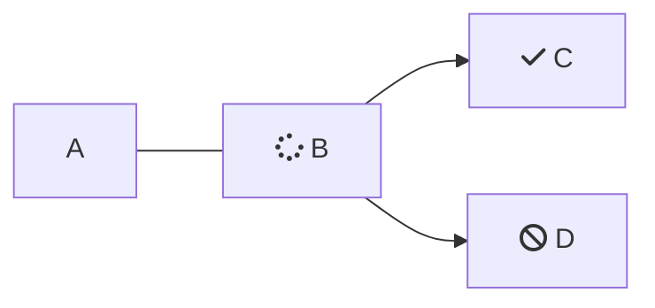

````markdown

```json
{
  "currency": "BRL",
  "country": "BR",
  "amount": 1000,
  "clientName": "John Doe"
  }
```

````
```json
{
  "currency": "BRL",
  "country": "BR",
  "amount": 1000,
  "clientName": "John Doe"
  }


```

<br />



<br />

<Cards columns={4}>
  <Card title="First Card" href="https://readme.com" icon="fa-home" target="_blank">
    Neque porro quisquam est qui dolorem ipsum quia
  </Card>

  <Card title="Second Card" icon="fa-user">
    *Lorem ipsum dolor sit amet, consectetur adipiscing elit*
  </Card>

  <Card title="Third Card" icon="fa-star">
    > Ut enim ad minim veniam, quis nostrud ullamco
  </Card>

  <Card title="Fourth Card" icon="fa-question">
    **Excepteur sint occaecat cupidatat non proident**
  </Card>
</Cards>

<Embed typeOfEmbed="github" url="" />

## Cómo hacer un pago

<br />

Consulta en [este enlace](www.la.com)

<br />

> ❗️ titulo
>
> bla bla bla

<br />

```json Ejemplo de body


{
  "currency": "BRL",
  "country": "BR",
  "amount": 1000,
  "clientName": "John Doe",
  "clientEmail": "johndoe@example.com",
  "clientPhone": "999999999",
  "clientDocument": "12345678912",
  "paymentMethod": "pix_payment",
  "urlConfirmation": "Webhook",
  "urlFinal": "example.com/successful",
  "urlRejected": "example.com/declined",
  "order": "1234",
  "sing": "Signature of the parameters",
  "typePixPayment": 1,
  "isIframePay": "true"
}
```
```
```

<br />

***

|    |    |    |
| :- | :- | :- |
| a  |    |    |
|    |    |    |

<br />

<HTMLBlock>{`
<!DOCTYPE html>
<html>
<body>

<p><a href="https://www.postman.com/prontopaga-api/workspace/prontopaga-docs/request/34607190-f4af4947-106e-4346-916a-e54c2d266f7a?action=share&creator=45976681&ctx=documentation" target="_blank">
  
</a></p>

</body>
</html>
`}</HTMLBlock>

<br />

<table>
  <tr>
    <th>Producto</th>
    <th>Imagen</th>
  </tr>

  <tr>
    <td>Zapatos</td>

    <td>
      
    </td>
  </tr>

  <tr>
    <td>Camiseta</td>

    <td>
      
    </td>
  </tr>
</table>

<Image align="center" border={false} src="https://files.readme.io/318f64c72032f868f3fa8cb7f77317be1c72910a3d70955e008e56a3865c4539-31.svg" />

<br />

<br />

<HTMLBlock>{`
<iframe style="border: 1px solid rgba(0, 0, 0, 0.1);" width="800" height="450" src="https://embed.figma.com/proto/sR8GayinfgLhXyMxlKjNJI/Demos-PayOuts-Prontopaga?page-id=11830%3A66971&node-id=11830-66973&viewport=1195%2C172%2C0.04&scaling=scale-down&content-scaling=fixed&starting-point-node-id=11830%3A66973&embed-host=share" allowfullscreen></iframe>
`}</HTMLBlock>

<Image align="center" border={false} src="https://files.readme.io/993783d3f97cd98ed52ccd0a1be04cc657b551f048139e85a23fbc3260267106-Coverage_in_Argentina.jpg" />

<br />

<HTMLBlock>{`
<Tabs>
  <Tab title="A">
       * **API:** Conjunto de reglas, protocolos y endpoints que permiten que tu sistema de software se comunique con otro.
	</Tab>
</Tabs>
`}</HTMLBlock>

Tabs>
\<Tab title="First Tab">
Welcome to the content that you can only see inside the first Tab.
\</Tab>

\<Tab title="Second Tab">
Here's content that's only inside the second Tab.
\</Tab>

\<Tab title="Third Tab">
Here's content that's only inside the third Tab.
\</Tab>
\</Tabs>

\<Tabs>
\<Tab title="First Tab">
Welcome to the content that you can only see inside the first Tab.
\</Tab>

\<Tab title="Second Tab">
Here's content that's only inside the second Tab.
\</Tab>

\<Tab title="Third Tab">
Here's content that's only inside the third Tab.
\</Tab>
\</Tabs>

\<Tabs>
\<Tab title="First Tab">
Welcome to the content that you can only see inside the first Tab.
\</Tab>

\<Tab title="Second Tab">
Here's content that's only inside the second Tab.
\</Tab>

\<Tab title="Third Tab">
Here's content that's only inside the third Tab.
\</Tab>
\</Tabs>

<br />

<br />

Payphone Wallet -> Ecuador

Se le puede pasar un bgColor (valor hexadecimal con su '#' al principio), mode (light o dark), type (default o simple)

* Crear nuevo endopoint: Ecuador Wallet (with customized form)
* Subir a postman
* Crear ejemplo 200 y 400

```
{
  "currency": "USD",
  "country": "EC",
  "amount": "25.90",
  "clientName": "John Doe",
  "clientEmail": "johndoe@example.com",
  "clientPhone": "0912345678",
  "clientDocument": "12345678912",
  "paymentMethod": "payphone_payment",
  "urlConfirmation": "https://www.webhook.com",
  "urlFinal": "https://sandbox.prontopaga.com/successful",
  "urlRejected": "https://sandbox.prontopaga.com/declined",
  "theme": "[{\"bgColor\": \"transparent\", \"mode\": \"dark\”, \"type\": \"simple\”}]”
	"order": "XYZ789",
	"sign": "Signature of the parameters"
}


 "theme": "[{\"bgColor\": \"transparent\", \"mode\": \"dark\"}]",
 "sign": "Signature of the parameters"
```

***

<br />

GmoneyQR, LigoQR y NiubizQR -> Perú

Ya estaba arriba con antelación

```
{
  "currency": "PEN",
  "country": "PE",
  "amount": "100.90",
  "clientName": "John Doe",
  "clientEmail": "johndoe@example.com",
  "clientPhone": "999999999",
  "clientDocument": "12345678912",
  "paymentMethod": "pe_qr_payment",
  "urlConfirmation": "https://www.webhook.com",
  "urlFinal": "https://sandbox.prontopaga.com/successful",
  "urlRejected": "https://sandbox.prontopaga.com/declined",
  "order": "XYZ789",
  "theme": "[{\"bgColor\": \"transparent\", \"mode\": \"dark\"}]",
  "sign": "Signature of the parameters"
}
```

***

<br />

Niubiz Tarjeta -> Perú

Ya estaba con antelación

```
{
  "currency": "PEN",
  "country": "PE",
  "amount": "100.90",
  "clientName": "John Doe",
  "clientEmail": "johndoe@example.com",
  "clientPhone": "999999999",
  "clientDocument": "12345678912",
  "paymentMethod": "pe_card_payment",
  "urlConfirmation": "https://www.webhook.com",
  "urlFinal": "https://sandbox.prontopaga.com/successful",
  "urlRejected": "https://sandbox.prontopaga.com/declined",
  "order": "XYZ789",
  "theme": "[{\"bgColor\": \"transparent\", \"mode\": \"dark\"}]",
  "sign": "Signature of the parameters"
}
```

***

PixQR BancoRendimiento -> Brasil

* Crear nuevo endpoint: Brazil PIX (with customized form)
* Subir a postman
* Crear ejemplo 200 y 400

```
{
  "currency": "BRL",
  "country": "BR",
  "amount": "150.90",
  "clientName": "John Doe",
  "clientEmail": "johndoe@example.com",
  "clientPhone": "999999999",
  "clientDocument": "12345678912",
  "paymentMethod": "pix_payment",
  "urlConfirmation": "https://www.webhook.com",
  "urlFinal": "https://sandbox.prontopaga.com/successful",
  "urlRejected": "https://sandbox.prontopaga.com/declined",
  "order": "XYZ789",
  "typePixPayment": 1,
  "sign": "Signature of the parameters"
}
```

<br />

<br />

## Plugins oficiales de ProntoPaga

Estos plugins están listos para ser integrados hoy mismo en tu comercio:

| <center><h2>Plataformas compatibles</h2></center>                                                                                                                                                                                                                                                                                                                                                                  |
| :----------------------------------------------------------------------------------------------------------------------------------------------------------------------------------------------------------------------------------------------------------------------------------------------------------------------------------------------------------------------------------------------------------------- |
| <center>        <Button variant="primary" text="Ver guía" icon="fa-solid fa-arrow-up-right-from-square" href="https://docs.prontopaga.com/docs/prestashop#/" target="_blank" /></center>               |
| <center>                   <Button variant="primary" text="Ver guía" icon="fa-solid fa-arrow-up-right-from-square" href="https://docs.prontopaga.com/docs/vtex#/" target="_blank" /></center>                            |
| <center>        <Button variant="primary" text="Ver guía" icon="fa-solid fa-arrow-up-right-from-square" href="https://docs.prontopaga.com/docs/woocommerce#/" target="_blank" /></center>                |
| <center>        <Button variant="primary" text="Ver guía" icon="fa-solid fa-arrow-up-right-from-square" href="https://docs.prontopaga.com/docs/magento#/" target="_blank" /></center> |

<GuideCard
  title="🚀 Cómo empezar tu integración"
  description={
    <ol>
      <li><h3>Selecciona tu plataforma</h3></li>
      <li><h3>Descarga e instala el plugin</h3></li>
      <li><h3>Prueba tu integración</h3></li>
      <li><h3>¡Listo!</h3></li>
   </ol>
  }
/>

<br />

<br />

## 🔌 Plugins oficiales de ProntoPaga

Estos plugins están listos para ser integrados hoy mismo en tu comercio:

<Cards columns={2}>
  <center>
    <Card>
      <div
        style={{
      display: 'flex',
      flexDirection: 'column',
      alignItems: 'center',
      justifyContent: 'center',
      height: '250px'
    }}
      >
        

        <h3>PrestaShop</h3>
        Optimiza el proceso de cobre en tiendas PrestaShop con el plugin de ProntoPaga.

        <Button variant="primary" text="Ver guía" icon="fa-solid fa-arrow-up-right-from-square" href="https://docs.prontopaga.com/docs/prestashop#/" target="_blank" />

        <br />
      </div>
    </Card>
  </center>

  <center>
    <Card>
      <div
        style={{
      display: 'flex',
      flexDirection: 'column',
      alignItems: 'center',
      justifyContent: 'center',
      height: '250px'
    }}
      >
        

        <h3>VTEX</h3>
        Mejora conversiones con transacciones seguras y rápidas con el plugin de ProntoPaga.

        <Button variant="primary" text="Ver guía" icon="fa-solid fa-arrow-up-right-from-square" href="https://docs.prontopaga.com/docs/vtex#/" target="_blank" />

        <br />
      </div>
    </Card>
  </center>

  <center>
    <Card>
      <div
        style={{
      display: 'flex',
      flexDirection: 'column',
      alignItems: 'center',
      justifyContent: 'center',
      height: '250px'
    }}
      >
        

        <h3>WooCommerce</h3>
        Con el plugin de ProntoPaga de Wordpress + WooCommerce acepta pagos de forma segura y rápida.

        <Button variant="primary" text="Ver guía" icon="fa-solid fa-arrow-up-right-from-square" href="https://docs.prontopaga.com/docs/woocommerce#/" target="_blank" />

        <br />
      </div>
    </Card>
  </center>

  <center>
    <Card>
      <div
        style={{
      display: 'flex',
      flexDirection: 'column',
      alignItems: 'center',
      justifyContent: 'center',
      height: '250px'
    }}
      >
        

        <h3>Adobe Commerce (Magento)</h3>
        Acepta pagos de forma segura y eficiente con el plugin de ProntoPaga con Adobe Commerce (antes Magento).

        <Button variant="primary" text="Ver guía" icon="fa-solid fa-arrow-up-right-from-square" href="https://docs.prontopaga.com/docs/magento#/" target="_blank" />

        <br />
      </div>
    </Card>
  </center>
</Cards>

## 🚀 Cómo empezar tu integración

<Cards columns={4} className="pp-cards--equal">
  <Card>
    <div
      style={{
      display: 'flex',
      flexDirection: 'column',
      alignItems: 'center',
      justifyContent: 'center',
      height: '200px'
    }}
    >
      <i className="fa-solid fa-hand-pointer" style={{ fontSize: '24px', marginBottom: '8px' }} />

      <strong><center>Selecciona tu plataforma</center></strong>
    </div>
  </Card>

  <Card>
    <div
      style={{
      display: 'flex',
      flexDirection: 'column',
      alignItems: 'center',
      justifyContent: 'center',
      height: '140px'
    }}
    >
      <i className="fa-solid fa-plug" style={{ fontSize: '24px', marginBottom: '8px' }} />

      <strong><center>Descarga e instala el plugin</center></strong>
    </div>
  </Card>

  <Card>
    <div
      style={{
      display: 'flex',
      flexDirection: 'column',
      alignItems: 'center',
      justifyContent: 'center',
      height: '140px'
    }}
    >
      <i className="fa-solid fa-vial" style={{ fontSize: '24px', marginBottom: '8px' }} />

      <strong><center>Prueba tu integración</center></strong>
    </div>
  </Card>

  <Card>
    <div
      style={{
      display: 'flex',
      flexDirection: 'column',
      alignItems: 'center',
      justifyContent: 'center',
      height: '140px'
    }}
    >
      <i className="fa-solid fa-circle-check" style={{ fontSize: '24px', marginBottom: '8px' }} />

      <strong><center>¡Listo!</center></strong>
    </div>
  </Card>
</Cards>

<br />

<br />

<br />

<HTMLBlock>{`
<table>
  <thead>
    <tr style="background-color:#ff1f55; color:white; text-align:left;">
      <th><b>Marca</b></th>
			<th><b>Argentina</b></th>
      <th><b>Chile</b></th>
      <th><b>Ecuador</b></th>
			<th><b>Perú</b></th>
    </tr>
  </thead>
  <tbody>
    <tr><td>Visa</td><td>✔️</td><td>✔️</td><td>✔️</td><td>✔️</td></tr></tr>
    <tr><td>Mastercard</td><td>✔️</td><td>✔️</td><td>✔️</td><td>✔️</td></tr></tr>
		<tr><td>American Express</td><td>✔️</td><td>✔️</td><td>✖️</td><td>✔️</td></tr></tr>
		<tr><td>Diners Club International</td><td>✖️</td><td>✖️</td><td>✖️</td><td>✔️</td></tr></tr>
    <tr><td>UnionPay</td><td>✖️</td><td>✖️</td><td>✖️</td><td>✔️</td></tr></tr>
  </tbody>
</table>
`}</HTMLBlock>

<br />

<br />

<Cards columns={3}>
  <center>
    <Card>
      <div>
        

        <Button variant="primary" text="Ver datos de prueba" icon="fa-solid fa-arrow-up-right-from-square" href="https://docs.prontopaga.com/docs/test-data-webpay-cards" target="_blank" />

        <br />
      </div>
    </Card>
  </center>

  <center>
    <Card>
      <div>
        

        <Button variant="primary" text="Ver datos de prueba" icon="fa-solid fa-arrow-up-right-from-square" href="https://docs.prontopaga.com/docs/test-data-ecuador" target="_blank" />

        <br />
      </div>
    </Card>
  </center>

  <center>
    <Card>
      <div>
        

        <Button variant="primary" text="Ver datos de prueba" icon="fa-solid fa-arrow-up-right-from-square" href="https://docs.prontopaga.com/docs/test-data-cards-peru" target="_blank" />

        <br />
      </div>
    </Card>
  </center>
</Cards>

<br />

<Cards columns={3}>
  <center>
    <Card>
      <div>
        

        Consulta los datos de prueba para PayIns en Chile

        <Button variant="primary" text="Ver datos" icon="fa-solid fa-arrow-up-right-from-square" href="https://docs.prontopaga.com/docs/test-data-webpay-cards" target="_blank" />

        <br />
      </div>
    </Card>
  </center>

  <center>
    <Card>
      <div>
        
        
				Consulta los datos de prueba para PayIns en Ecuador
        <Button variant="primary" text="Ver datos" icon="fa-solid fa-arrow-up-right-from-square" href="https://docs.prontopaga.com/docs/test-data-ecuador" target="_blank" />

        <br />
      </div>
    </Card>
  </center>

  <center>
    <Card>
      <div>
        

        <Button variant="primary" text="Ver datos de prueba" icon="fa-solid fa-arrow-up-right-from-square" href="https://docs.prontopaga.com/docs/test-data-cards-peru" target="_blank" />

        <br />
      </div>
    </Card>
  </center>
</Cards>
